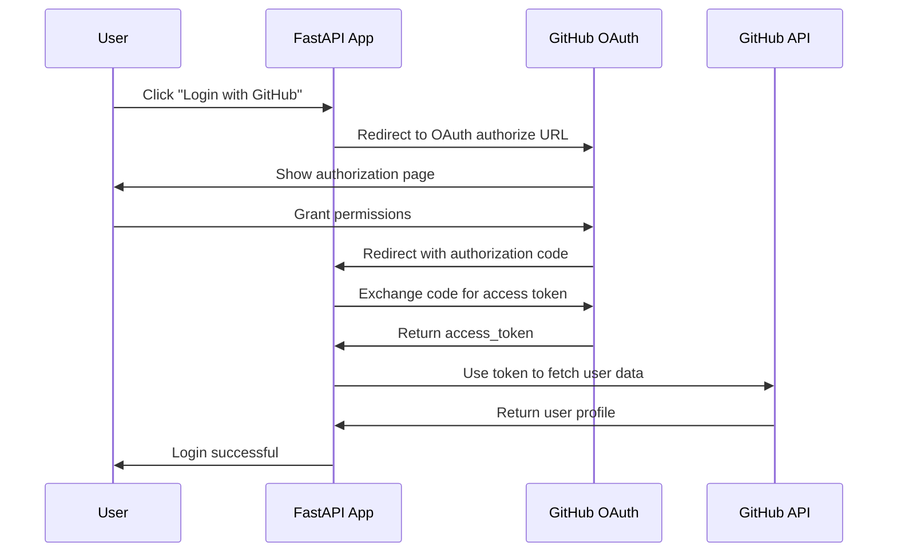

# Phase 5: GitHub OAuth2 Authentication Support

## Objective

Add comprehensive GitHub OAuth2 authentication support to enable upstream projects to authenticate users via GitHub, leveraging `ghapi` with `client_id` and `client_secret` for complete user authentication workflows.

Design goal: library-only usage with safe defaults.

- OAuth2 is enabled by default only when valid configuration is present (config-gated auto-routes). 
- No import-time side effects. No routes are mounted unless the host app creates a `GitHubApp` and calls `init_app()`.
- Routes mount under a namespaced prefix (default: `/auth/github`).
- A global kill switch (`enable_oauth=False`) disables OAuth2 routing entirely.

## GitHub OAuth2 Flow Overview



## Implementation Design

### 1. OAuth2 Manager Class

```python
# src/githubapp/oauth.py
from typing import Optional, Dict, List, Callable, Any
from urllib.parse import urlencode
import secrets
import httpx
from fastapi import Request, HTTPException, Depends
from fastapi.responses import RedirectResponse
from ghapi.all import GhApi

class GitHubOAuth2:
    """GitHub OAuth2 authentication manager"""
    
    def __init__(
        self,
        client_id: str,
        client_secret: str,
        *,
        redirect_uri: str = None,
        scopes: List[str] = None,
        base_url: str = "https://github.com",
        api_url: str = "https://api.github.com"
    ):
        self.client_id = client_id
        self.client_secret = client_secret
        self.redirect_uri = redirect_uri
        self.scopes = scopes or ["user:email", "read:user"]
        self.base_url = base_url
        self.api_url = api_url
        
        # State management for CSRF protection
        self._state_store: Dict[str, Dict] = {}
        
        # User session callbacks
        self._login_callbacks: List[Callable] = []
        self._logout_callbacks: List[Callable] = []
    
    def generate_auth_url(
        self,
        state: str = None,
        scopes: List[str] = None,
        redirect_uri: str = None
    ) -> str:
        """Generate GitHub OAuth authorization URL"""
        
        if state is None:
            state = secrets.token_urlsafe(32)
        
        # Store state for validation
        self._state_store[state] = {
            "timestamp": time.time(),
            "redirect_uri": redirect_uri or self.redirect_uri,
            "scopes": scopes or self.scopes
        }
        
        params = {
            "client_id": self.client_id,
            "redirect_uri": redirect_uri or self.redirect_uri,
            "scope": " ".join(scopes or self.scopes),
            "state": state,
            "allow_signup": "true"
        }
        
        return f"{self.base_url}/login/oauth/authorize?{urlencode(params)}"
    
    async def exchange_code_for_token(
        self,
        code: str,
        state: str = None
    ) -> Dict[str, Any]:
        """Exchange authorization code for access token"""
        
        # Validate state to prevent CSRF attacks
        if state and state not in self._state_store:
            raise HTTPException(status_code=400, detail="Invalid state parameter")
        
        async with httpx.AsyncClient() as client:
            response = await client.post(
                f"{self.base_url}/login/oauth/access_token",
                data={
                    "client_id": self.client_id,
                    "client_secret": self.client_secret,
                    "code": code,
                },
                headers={"Accept": "application/json"}
            )
            
            if response.status_code != 200:
                raise HTTPException(
                    status_code=response.status_code,
                    detail="Failed to exchange code for token"
                )
            
            token_data = response.json()
            
            if "error" in token_data:
                raise HTTPException(
                    status_code=400,
                    detail=f"OAuth error: {token_data.get('error_description', 'Unknown error')}"
                )
            
            # Clean up state
            if state:
                self._state_store.pop(state, None)
            
            return token_data
    
    async def get_user_info(self, access_token: str) -> Dict[str, Any]:
        """Get user information using access token"""
        
        # Use ghapi for consistent API access
        client = GhApi(token=access_token, base_url=self.api_url)
        
        try:
            # Get basic user info
            user = client.users.get_authenticated()
            
            # Get user emails (if scope permits)
            try:
                emails = client.users.list_emails_for_authenticated_user()
                user["emails"] = emails
            except Exception:
                # Scope might not include email access
                user["emails"] = []
            
            return user
        except Exception as e:
            raise HTTPException(
                status_code=401,
                detail=f"Failed to fetch user info: {str(e)}"
            )
    
    def on_login(self, callback: Callable[[Dict[str, Any]], Any]):
        """Register callback for successful login"""
        self._login_callbacks.append(callback)
        return callback
    
    def on_logout(self, callback: Callable[[Dict[str, Any]], Any]):
        """Register callback for logout"""
        self._logout_callbacks.append(callback)
        return callback
    
    async def trigger_login_callbacks(self, user_data: Dict[str, Any]):
        """Trigger all registered login callbacks"""
        for callback in self._login_callbacks:
            try:
                if inspect.iscoroutinefunction(callback):
                    await callback(user_data)
                else:
                    callback(user_data)
            except Exception as e:
                # Log error but don't break the flow
                logging.error(f"Login callback error: {e}")
```

### 2. Enhanced GitHubApp Class with OAuth2 Support (Gated, Enabled-by-Default)

```python
# Updates to src/githubapp/core.py
from .oauth import GitHubOAuth2

class GitHubApp:
    """Enhanced GitHubApp with OAuth2 support"""
    
    def __init__(
        self,
        app: FastAPI = None,
        *,
        # Existing GitHub App parameters
        github_app_id: int = None,
        github_app_key: bytes = None,
        github_app_secret: bytes = None,
        github_app_url: str = None,
        github_app_route: str = "/",
        # New OAuth2 parameters
        oauth_client_id: str = None,
        oauth_client_secret: str = None,
        oauth_redirect_uri: str = None,
        oauth_scopes: List[str] = None,
    oauth_routes_prefix: str = "/auth/github",
    enable_oauth: bool = None,
    oauth_session_secret: str = None,
    ):
        # Initialize existing functionality
        self._hook_mappings = {}
        self._access_token = None
        self.base_url = github_app_url or "https://api.github.com"
        self.id = github_app_id
        self.key = github_app_key
        self.secret = github_app_secret
        self.router = APIRouter()
        
        # Initialize OAuth2 if credentials provided (gated)
        self.oauth = None
        if oauth_client_id and oauth_client_secret:
            self.oauth = GitHubOAuth2(
                client_id=oauth_client_id,
                client_secret=oauth_client_secret,
                redirect_uri=oauth_redirect_uri,
                scopes=oauth_scopes
            )
            # Enabled by default, but routes will only mount if session secret is also present
            self._enable_oauth = enable_oauth if enable_oauth is not None else True
            self._oauth_routes_prefix = oauth_routes_prefix
            self._oauth_session_secret = oauth_session_secret
        else:
            self._enable_oauth = False
        
        if app is not None:
            self.init_app(app, route=github_app_route)
    
    def init_app(self, app: FastAPI, *, route: str = "/"):
        """Initialize app with both webhook and OAuth2 routes"""
        
        # Initialize existing webhook functionality
        app.include_router(self.router)
        self.router.post(route)(self._handle_request)
        
        # Initialize OAuth2 routes if enabled AND fully configured
        if self._enable_oauth and self.oauth and self._oauth_session_secret:
            self._setup_oauth_routes(app)
        
        # Configuration setup (existing + OAuth2)
        if not hasattr(app, "config"):
            app.config = {}
        self.config = app.config
        
        # Set OAuth2 config from constructor or environment
        self._load_oauth_config()
    
    def _setup_oauth_routes(self, app: FastAPI):
        """Setup OAuth2 authentication routes"""
        
        prefix = self._oauth_routes_prefix
        
    @app.get(f"{prefix}/login")
        async def oauth_login(
            request: Request,
            redirect_to: str = None,
            scopes: str = None
        ):
            """Initiate GitHub OAuth login"""
            
            # Parse scopes if provided
            scope_list = scopes.split(",") if scopes else None
            
            # Generate auth URL
            auth_url = self.oauth.generate_auth_url(
                scopes=scope_list,
                redirect_uri=str(request.url_for("oauth_callback"))
            )
            
            # Store redirect destination in session/state
            if redirect_to:
                # You might want to store this in session or state
                pass
            
            return RedirectResponse(url=auth_url)
        
    @app.get(f"{prefix}/callback")
        async def oauth_callback(
            request: Request,
            code: str = None,
            state: str = None,
            error: str = None
        ):
            """Handle OAuth callback from GitHub"""
            
            if error:
                raise HTTPException(
                    status_code=400,
                    detail=f"OAuth error: {error}"
                )
            
            if not code:
                raise HTTPException(
                    status_code=400,
                    detail="Missing authorization code"
                )
            
            try:
                # Exchange code for token
                token_data = await self.oauth.exchange_code_for_token(code, state)
                
                # Get user information
                user_info = await self.oauth.get_user_info(token_data["access_token"])
                
                # Trigger login callbacks
                await self.oauth.trigger_login_callbacks({
                    "user": user_info,
                    "token": token_data,
                    "request": request
                })
                
                # Return success response or redirect
                return {
                    "status": "success",
                    "user": {
                        "id": user_info["id"],
                        "login": user_info["login"],
                        "name": user_info.get("name"),
                        "email": user_info.get("email"),
                        "avatar_url": user_info.get("avatar_url")
                    }
                }
                
            except HTTPException:
                raise
            except Exception as e:
                raise HTTPException(
                    status_code=500,
                    detail=f"OAuth callback error: {str(e)}"
                )
        
    @app.post(f"{prefix}/logout")
        async def oauth_logout(request: Request):
            """Handle user logout"""
            
            # Trigger logout callbacks
            await self.oauth.trigger_logout_callbacks({
                "request": request
            })
            
            return {"status": "logged_out"}
        
    @app.get(f"{prefix}/user")
        async def get_current_user(user=Depends(self.get_current_user)):
            """Get current authenticated user"""
            return user
    
    def _load_oauth_config(self):
        """Load OAuth2 configuration from environment"""
        
        if self.oauth:
            # Update from environment variables if not set in constructor
            if not self.oauth.client_id:
                self.oauth.client_id = os.getenv("GITHUBAPP_OAUTH_CLIENT_ID")
            if not self.oauth.client_secret:
                self.oauth.client_secret = os.getenv("GITHUBAPP_OAUTH_CLIENT_SECRET")
            if not self.oauth.redirect_uri:
                self.oauth.redirect_uri = os.getenv("GITHUBAPP_OAUTH_REDIRECT_URI")
            
            # Store in config for consistency
            self.config.update({
                "GITHUBAPP_OAUTH_CLIENT_ID": self.oauth.client_id,
                "GITHUBAPP_OAUTH_CLIENT_SECRET": self.oauth.client_secret,
                "GITHUBAPP_OAUTH_REDIRECT_URI": self.oauth.redirect_uri,
                "GITHUBAPP_OAUTH_SCOPES": self.oauth.scopes,
            })
    
    def oauth_client(self, access_token: str) -> GhApi:
        """Create GitHub API client with user access token"""
        return GhApi(token=access_token, base_url=self.base_url)
    
    def get_current_user(self):
        """FastAPI dependency for getting current authenticated user"""
        # Validates JWT from Authorization header or cookie; requires oauth_session_secret.
        # If not configured, raises 401 when used.
        pass
    
    # OAuth2 decorators for easy integration
    def on_user_login(self, callback: Callable):
        """Decorator for user login events"""
        if self.oauth:
            return self.oauth.on_login(callback)
        return callback
    
    def on_user_logout(self, callback: Callable):
        """Decorator for user logout events"""
        if self.oauth:
            return self.oauth.on_logout(callback)
        return callback
```

### 3. Session Management Integration

```python
# src/githubapp/session.py
from typing import Optional, Dict, Any
from fastapi import Request, Depends, HTTPException
import jwt
from datetime import datetime, timedelta

class SessionManager:
    """Manage user sessions for OAuth2 authentication"""
    
    def __init__(self, secret_key: str, algorithm: str = "HS256"):
        self.secret_key = secret_key
        self.algorithm = algorithm
    
    def create_session_token(
        self,
        user_data: Dict[str, Any],
        expires_delta: timedelta = None
    ) -> str:
        """Create JWT session token"""
        
        if expires_delta is None:
            expires_delta = timedelta(hours=24)
        
        expire = datetime.utcnow() + expires_delta
        
        payload = {
            "sub": str(user_data["id"]),
            "login": user_data["login"],
            "exp": expire,
            "iat": datetime.utcnow(),
            "type": "session"
        }
        
        return jwt.encode(payload, self.secret_key, algorithm=self.algorithm)
    
    def verify_session_token(self, token: str) -> Dict[str, Any]:
        """Verify and decode session token"""
        
        try:
            payload = jwt.decode(
                token, 
                self.secret_key, 
                algorithms=[self.algorithm]
            )
            
            if payload.get("type") != "session":
                raise HTTPException(status_code=401, detail="Invalid token type")
            
            return payload
            
        except jwt.ExpiredSignatureError:
            raise HTTPException(status_code=401, detail="Token expired")
        except jwt.JWTError:
            raise HTTPException(status_code=401, detail="Invalid token")
    
    def get_current_user_dependency(self):
        """Create FastAPI dependency for current user"""
        
        def get_current_user(request: Request) -> Dict[str, Any]:
            # Check for token in Authorization header
            auth_header = request.headers.get("Authorization")
            if auth_header and auth_header.startswith("Bearer "):
                token = auth_header.split(" ")[1]
                return self.verify_session_token(token)
            
            # Check for token in cookies
            token = request.cookies.get("session_token")
            if token:
                return self.verify_session_token(token)
            
            raise HTTPException(
                status_code=401,
                detail="No valid authentication found"
            )
        
        return get_current_user
```

## Configuration Options

```python
# Environment variables for OAuth2
GITHUBAPP_OAUTH_CLIENT_ID = "your_oauth_app_client_id"
GITHUBAPP_OAUTH_CLIENT_SECRET = "your_oauth_app_client_secret"
GITHUBAPP_OAUTH_REDIRECT_URI = "http://localhost:8000/auth/github/callback"
GITHUBAPP_OAUTH_SCOPES = "user:email,read:user,repo"  # Comma-separated
GITHUBAPP_OAUTH_SESSION_SECRET = "your-secret-key-for-sessions"  # REQUIRED to auto-mount routes
GITHUBAPP_ENABLE_OAUTH = "true|false"  # Optional global kill switch
GITHUBAPP_OAUTH_TOKEN_EXPIRES_HOURS = 24
```

## Usage Examples

### 1. Basic OAuth2 Setup

```python
from fastapi import FastAPI, Depends
from githubapp import GitHubApp

app = FastAPI()

# Setup with both webhook and OAuth2 support
github_app = GitHubApp(
    app,
    # GitHub App credentials (for webhooks)
    github_app_id=12345,
    github_app_key=private_key_bytes,
    github_app_secret=webhook_secret,
    # OAuth2 credentials (for user authentication)
    oauth_client_id=os.getenv("GITHUBAPP_OAUTH_CLIENT_ID"),
    oauth_client_secret=os.getenv("GITHUBAPP_OAUTH_CLIENT_SECRET"),
    oauth_redirect_uri="http://localhost:8000/auth/github/callback",
    oauth_scopes=["user:email", "read:user"]
)

# Handle user login events
@github_app.on_user_login
async def handle_user_login(login_data):
    user = login_data["user"]
    token = login_data["token"]
    
    print(f"User {user['login']} logged in!")
    
    # Store user in database, create session, etc.
    await store_user_in_database(user)

# Protected route requiring authentication
@app.get("/dashboard")
async def dashboard(current_user=Depends(github_app.get_current_user)):
    return {
        "message": f"Welcome {current_user['login']}!",
        "user": current_user
    }

# Use OAuth2 client to access GitHub API as user
@app.get("/my-repos")
async def get_my_repos(current_user=Depends(github_app.get_current_user)):
    # Create GitHub client with user's access token
    user_client = github_app.oauth_client(current_user["access_token"])
    
    # Fetch user's repositories
    repos = user_client.repos.list_for_authenticated_user()
    
    return {"repositories": repos}
```

### 2. Integration with Existing Webhook Handlers

```python
# Webhook handlers can interact with authenticated users
@github_app.on("issues.opened")
async def handle_issue_opened():
    payload = github_app.payload
    issue = payload["issue"]
    
    # Get issue author information via OAuth2 (if they're authenticated)
    author_login = issue["user"]["login"]
    
    # Check if user is authenticated in your system
    user_session = await get_user_session_by_github_login(author_login)
    
    if user_session:
        # User is authenticated - can perform additional actions
        print(f"Issue opened by authenticated user: {author_login}")
        await notify_authenticated_user(user_session, "Your issue has been received!")
    else:
        # Regular webhook processing for non-authenticated users
        print(f"Issue opened by user: {author_login}")
```

### 3. Frontend Integration

```html
<!-- Login button -->
<a href="/auth/github/login?redirect_to=/dashboard" class="btn btn-primary">
    Login with GitHub
</a>

<!-- JavaScript for handling OAuth flow -->
<script>
async function checkAuthStatus() {
    try {
        const response = await fetch('/auth/github/user');
        if (response.ok) {
            const user = await response.json();
            showUserInfo(user);
        } else {
            showLoginButton();
        }
    } catch (error) {
        showLoginButton();
    }
}

async function logout() {
    await fetch('/auth/github/logout', { method: 'POST' });
    window.location.reload();
}
</script>
```

## Implementation Tasks

### Phase 5a: Core OAuth2 Implementation (1-2 weeks)

- [ ] Create `GitHubOAuth2` class with full OAuth2 flow
- [ ] Add OAuth2 routes to `GitHubApp` class
- [ ] Implement state management for CSRF protection
- [ ] Add user info fetching via `ghapi`
- [ ] Create callback system for login/logout events

### Phase 5b: Session Management (1 week)

- [ ] Implement `SessionManager` class with JWT tokens
- [ ] Add FastAPI dependencies for authentication
- [ ] Create middleware for automatic session validation
- [ ] Add session storage options (memory, Redis, database)

### Phase 5c: Integration & Security (1 week)

- [ ] Integrate OAuth2 with existing webhook functionality
- [ ] Add comprehensive security features (CSRF, rate limiting)
- [ ] Implement token refresh functionality
- [ ] Add logout and session cleanup

### Phase 5d: Documentation & Examples (1 week)

- [ ] Create comprehensive documentation
- [ ] Add example applications showing OAuth2 integration
- [ ] Update README with OAuth2 configuration
- [ ] Create migration guide for existing users

## Security Considerations

1. **CSRF Protection**: Use state parameter validation
2. **Token Security**: Secure storage and transmission of tokens
3. **Scope Limitation**: Request minimal necessary permissions
4. **Session Management**: Proper session expiration and cleanup
5. **Rate Limiting**: Protect OAuth2 endpoints from abuse

## Testing Strategy

```python
# Test OAuth2 flow
def test_oauth_login_flow():
    # Test authorization URL generation
    # Test callback handling
    # Test user info fetching
    # Test session creation

def test_oauth_security():
    # Test CSRF protection
    # Test invalid state handling
    # Test token validation
    # Test session expiration
```

This comprehensive OAuth2 implementation will give your library complete GitHub authentication capabilities while maintaining the same isolation and compatibility principles we established for the task queue features.
