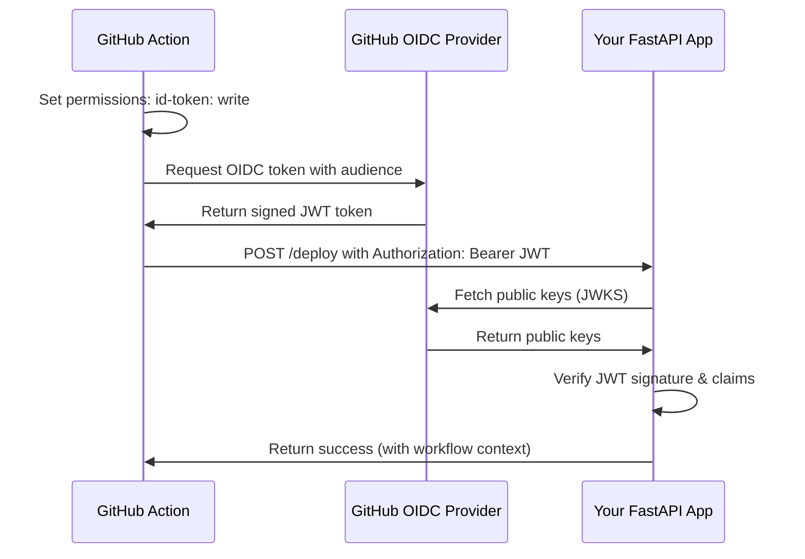

# Phase 6: GitHub OIDC (OpenID Connect) Support for Actions

## Objective

Add GitHub OIDC support to enable secure authentication from GitHub Actions workflows, allowing CI/CD pipelines to authenticate with your FastAPI applications without storing long-lived secrets.

## OIDC vs OAuth2 vs GitHub App Comparison

| Feature | GitHub App | OAuth2 | OIDC |
|---------|------------|--------|------|
| **Use Case** | Webhook automation | User authentication | CI/CD authentication |
| **Authentication** | JWT with private key | Authorization code flow | JWT from GitHub Actions |
| **Token Lifespan** | 1 hour | Configurable (hours/days) | ~10 minutes |
| **Secrets Required** | Private key, webhook secret | Client ID, client secret | None (uses GitHub's OIDC provider) |
| **Security** | High (app-level) | High (user-level) | Highest (short-lived, cryptographically verified) |

## GitHub OIDC Flow



## Implementation Design

### 1. OIDC Manager Class

```python
# src/githubapp/oidc.py
from typing import Optional, Dict, Any, List
from pydantic import BaseModel, Field
from fastapi import HTTPException, Security
from fastapi.security import OpenIdConnect
from fastapi.security.base import SecurityBase
from fastapi.security.utils import get_authorization_scheme_param
from jwt import InvalidTokenError, PyJWKClient, decode
import logging
import httpx
from functools import lru_cache

logger = logging.getLogger(__name__)

class GitHubOIDCClaims(BaseModel):
    """GitHub OIDC JWT Claims with comprehensive workflow context"""
    
    # Standard JWT claims
    sub: Optional[str] = None  # Subject (repository:environment or repository:ref:...)
    aud: Optional[str] = None  # Audience
    exp: Optional[int] = None  # Expiration time
    iat: Optional[int] = None  # Issued at
    iss: Optional[str] = None  # Issuer (https://token.actions.githubusercontent.com)
    jti: Optional[str] = None  # JWT ID
    nbf: Optional[int] = None  # Not before
    
    # GitHub-specific claims
    ref: Optional[str] = None              # Git ref (refs/heads/main)
    sha: Optional[str] = None              # Git SHA
    repository: Optional[str] = None        # owner/repo
    repository_id: Optional[int] = None     # Numeric repository ID
    repository_owner: Optional[str] = None  # Repository owner
    repository_owner_id: Optional[int] = None
    
    # Organization/Enterprise
    enterprise: Optional[str] = None
    enterprise_id: Optional[int] = None
    
    # Workflow execution context
    run_id: Optional[int] = None           # Workflow run ID
    run_number: Optional[int] = None       # Workflow run number
    run_attempt: Optional[int] = None      # Retry attempt number
    
    # Actor (user who triggered the workflow)
    actor: Optional[str] = None            # GitHub username
    actor_id: Optional[int] = None         # Numeric user ID
    
    # Workflow metadata
    workflow: Optional[str] = None         # Workflow name
    workflow_ref: Optional[str] = None     # Workflow ref
    workflow_sha: Optional[str] = None     # Workflow SHA
    
    # Pull request context (for PR-triggered workflows)
    head_ref: Optional[str] = None         # PR head ref
    base_ref: Optional[str] = None         # PR base ref
    
    # Event context
    event_name: Optional[str] = None       # Event that triggered workflow
    ref_type: Optional[str] = None         # Type of ref (branch, tag)
    ref_protected: Optional[bool] = None   # Whether ref is protected
    
    # Environment
    environment: Optional[str] = None           # Deployment environment
    environment_node_id: Optional[str] = None  # Environment node ID
    
    # Job context
    job_workflow_ref: Optional[str] = None  # Job workflow reference
    job_workflow_sha: Optional[str] = None  # Job workflow SHA
    
    # Repository metadata
    repository_visibility: Optional[str] = None  # public, private, internal
    
    # Runner context
    runner_environment: Optional[str] = None  # github-hosted, self-hosted
    
    # Scope information
    issuer_scope: Optional[str] = None
    
    def is_pull_request(self) -> bool:
        """Check if this workflow was triggered by a pull request"""
        return self.event_name == "pull_request"
    
    def is_main_branch(self) -> bool:
        """Check if this workflow is running on the main branch"""
        return self.ref in ["refs/heads/main", "refs/heads/master"]
    
    def is_protected_ref(self) -> bool:
        """Check if this workflow is running on a protected ref"""
        return self.ref_protected is True
    
    def get_branch_name(self) -> Optional[str]:
        """Extract branch name from ref"""
        if self.ref and self.ref.startswith("refs/heads/"):
            return self.ref[11:]  # Remove "refs/heads/"
        return None
    
    def get_tag_name(self) -> Optional[str]:
        """Extract tag name from ref"""
        if self.ref and self.ref.startswith("refs/tags/"):
            return self.ref[10:]  # Remove "refs/tags/"
        return None

class GitHubOIDC(SecurityBase):
    """GitHub OIDC authentication for GitHub Actions"""
    
    def __init__(
        self,
        *,
        audience: str,
        auto_error: bool = True,
        allowed_repositories: Optional[List[str]] = None,
        allowed_actors: Optional[List[str]] = None,
        allowed_environments: Optional[List[str]] = None,
        require_protected_ref: bool = False,
        jwks_cache_ttl: int = 3600  # 1 hour
    ):
        """
        Initialize GitHub OIDC authentication
        
        Args:
            audience: Required audience for JWT validation (your domain/app identifier)
            auto_error: Whether to raise HTTPException on auth failures
            allowed_repositories: List of allowed repositories (owner/repo format)
            allowed_actors: List of allowed GitHub usernames
            allowed_environments: List of allowed deployment environments
            require_protected_ref: Whether to require protected refs only
            jwks_cache_ttl: How long to cache JWKS keys (seconds)
        """
        self.audience = audience
        self.auto_error = auto_error
        self.allowed_repositories = allowed_repositories or []
        self.allowed_actors = allowed_actors or []
        self.allowed_environments = allowed_environments or []
        self.require_protected_ref = require_protected_ref
        self.jwks_cache_ttl = jwks_cache_ttl
        
        # Initialize JWKS client with caching
        self._jwks_client = PyJWKClient(
            "https://token.actions.githubusercontent.com/.well-known/jwks",
            cache_ttl=jwks_cache_ttl
        )
        
        self.scheme_name = self.__class__.__name__
    
    async def __call__(
        self,
        authorization: str = Security(
            OpenIdConnect(
                openIdConnectUrl="https://token.actions.githubusercontent.com/.well-known/openid-configuration"
            )
        )
    ) -> Optional[GitHubOIDCClaims]:
        """Validate GitHub OIDC token and return claims"""
        
        scheme, token = get_authorization_scheme_param(authorization)
        if not authorization or scheme.lower() != "bearer":
            if self.auto_error:
                raise HTTPException(
                    status_code=403,
                    detail="Invalid authorization header. Expected: Authorization: Bearer <token>"
                )
            return None
        
        try:
            # Get signing key from JWKS
            signing_key = self._jwks_client.get_signing_key_from_jwt(token)
            
            # Decode and verify JWT
            claims_dict = decode(
                token,
                signing_key.key,
                algorithms=["RS256"],
                audience=self.audience,
                issuer="https://token.actions.githubusercontent.com"
            )
            
            # Parse claims into structured model
            claims = GitHubOIDCClaims(**claims_dict)
            
            # Perform additional validation
            await self._validate_claims(claims)
            
            return claims
            
        except InvalidTokenError as e:
            logger.warning(f"Invalid OIDC token: {e}")
            if self.auto_error:
                raise HTTPException(
                    status_code=403,
                    detail=f"Invalid OIDC token: {str(e)}"
                )
            return None
        except Exception as e:
            logger.error(f"OIDC authentication failed: {e}")
            if self.auto_error:
                raise HTTPException(
                    status_code=403,
                    detail="OIDC authentication failed"
                )
            return None
    
    async def _validate_claims(self, claims: GitHubOIDCClaims):
        """Perform additional validation on claims"""
        
        # Repository validation
        if self.allowed_repositories and claims.repository not in self.allowed_repositories:
            raise HTTPException(
                status_code=403,
                detail=f"Repository '{claims.repository}' not allowed"
            )
        
        # Actor validation
        if self.allowed_actors and claims.actor not in self.allowed_actors:
            raise HTTPException(
                status_code=403,
                detail=f"Actor '{claims.actor}' not allowed"
            )
        
        # Environment validation
        if self.allowed_environments and claims.environment not in self.allowed_environments:
            raise HTTPException(
                status_code=403,
                detail=f"Environment '{claims.environment}' not allowed"
            )
        
        # Protected ref validation
        if self.require_protected_ref and not claims.is_protected_ref():
            raise HTTPException(
                status_code=403,
                detail="Deployment only allowed from protected refs"
            )

# Client-side helper for GitHub Actions
class GitHubOIDCClient:
    """Client helper for making OIDC-authenticated requests from GitHub Actions"""
    
    @staticmethod
    def get_actions_token(audience: str) -> str:
        """Get OIDC token from GitHub Actions environment"""
        import os
        
        actions_token = os.environ.get("ACTIONS_ID_TOKEN_REQUEST_TOKEN")
        actions_url = os.environ.get("ACTIONS_ID_TOKEN_REQUEST_URL")
        
        if not actions_token or not actions_url:
            raise RuntimeError(
                "GitHub Actions OIDC environment not found. "
                "Ensure workflow has 'id-token: write' permission and is running in GitHub Actions."
            )
        
        # Request token from GitHub Actions OIDC provider
        import httpx
        response = httpx.get(
            f"{actions_url}&audience={audience}",
            headers={"Authorization": f"Bearer {actions_token}"}
        )
        response.raise_for_status()
        
        return response.json()["value"]
    
    @staticmethod
    def get_auth_headers(audience: str) -> Dict[str, str]:
        """Get authorization headers for OIDC authentication"""
        token = GitHubOIDCClient.get_actions_token(audience)
        return {"Authorization": f"Bearer {token}"}
    
    @staticmethod
    async def make_authenticated_request(
        url: str,
        audience: str,
        method: str = "GET",
        **kwargs
    ) -> httpx.Response:
        """Make an authenticated request using OIDC token"""
        headers = GitHubOIDCClient.get_auth_headers(audience)
        if "headers" in kwargs:
            kwargs["headers"].update(headers)
        else:
            kwargs["headers"] = headers
        
        async with httpx.AsyncClient() as client:
            response = await client.request(method, url, **kwargs)
            return response
```

### 2. Enhanced GitHubApp Class with OIDC Support

```python
# Updates to src/githubapp/core.py
from .oidc import GitHubOIDC, GitHubOIDCClaims, GitHubOIDCClient

class GitHubApp:
    """Enhanced GitHubApp with OIDC support"""
    
    def __init__(
        self,
        app: FastAPI = None,
        *,
        # Existing parameters
        github_app_id: int = None,
        github_app_key: bytes = None,
        github_app_secret: bytes = None,
        github_app_url: str = None,
        github_app_route: str = "/",
        # OAuth2 parameters
        oauth_client_id: str = None,
        oauth_client_secret: str = None,
        oauth_redirect_uri: str = None,
        oauth_scopes: List[str] = None,
        oauth_routes_prefix: str = "/auth/github",
        enable_oauth: bool = None,
        # New OIDC parameters
        oidc_audience: str = None,
        oidc_allowed_repositories: List[str] = None,
        oidc_allowed_actors: List[str] = None,
        oidc_allowed_environments: List[str] = None,
        oidc_require_protected_ref: bool = False,
        enable_oidc: bool = None
    ):
        # Initialize existing functionality
        self._hook_mappings = {}
        self._access_token = None
        self.base_url = github_app_url or "https://api.github.com"
        self.id = github_app_id
        self.key = github_app_key
        self.secret = github_app_secret
        self.router = APIRouter()
        
        # Initialize OAuth2 (existing)
        self.oauth = None
        if oauth_client_id and oauth_client_secret:
            # ... OAuth2 initialization code ...
        
        # Initialize OIDC
        self.oidc = None
        if oidc_audience:
            self.oidc = GitHubOIDC(
                audience=oidc_audience,
                allowed_repositories=oidc_allowed_repositories,
                allowed_actors=oidc_allowed_actors,
                allowed_environments=oidc_allowed_environments,
                require_protected_ref=oidc_require_protected_ref
            )
            self._enable_oidc = enable_oidc if enable_oidc is not None else True
        else:
            self._enable_oidc = False
        
        if app is not None:
            self.init_app(app, route=github_app_route)
    
    def init_app(self, app: FastAPI, *, route: str = "/"):
        """Initialize app with webhook, OAuth2, and OIDC support"""
        
        # Initialize existing functionality
        app.include_router(self.router)
        self.router.post(route)(self._handle_request)
        
        # Initialize OAuth2 routes if enabled
        if self._enable_oauth and self.oauth:
            self._setup_oauth_routes(app)
        
        # Initialize OIDC examples if enabled
        if self._enable_oidc and self.oidc:
            self._setup_oidc_examples(app)
        
        # Configuration setup
        if not hasattr(app, "config"):
            app.config = {}
        self.config = app.config
        
        self._load_oidc_config()
    
    def _setup_oidc_examples(self, app: FastAPI):
        """Setup example OIDC-protected routes"""
        
        @app.post("/deploy")
        async def deploy_endpoint(
            claims: GitHubOIDCClaims = Security(self.oidc)
        ):
            """Example deployment endpoint protected by OIDC"""
            return {
                "status": "success",
                "message": f"Deployment triggered by {claims.actor} from {claims.repository}",
                "workflow_context": {
                    "repository": claims.repository,
                    "ref": claims.ref,
                    "sha": claims.sha,
                    "actor": claims.actor,
                    "workflow": claims.workflow,
                    "run_id": claims.run_id,
                    "environment": claims.environment
                }
            }
        
        @app.get("/oidc/health")
        async def oidc_health():
            """Health check for OIDC configuration"""
            return {
                "oidc_enabled": self._enable_oidc,
                "audience": self.oidc.audience if self.oidc else None,
                "allowed_repositories": self.oidc.allowed_repositories if self.oidc else [],
                "require_protected_ref": self.oidc.require_protected_ref if self.oidc else False
            }
    
    def _load_oidc_config(self):
        """Load OIDC configuration from environment"""
        
        if self.oidc:
            # Load from environment variables if not set in constructor
            import os
            
            if not self.oidc.audience:
                self.oidc.audience = os.getenv("GITHUBAPP_OIDC_AUDIENCE")
            
            # Store in config for consistency
            self.config.update({
                "GITHUBAPP_OIDC_AUDIENCE": self.oidc.audience,
                "GITHUBAPP_OIDC_ALLOWED_REPOSITORIES": self.oidc.allowed_repositories,
                "GITHUBAPP_OIDC_ALLOWED_ACTORS": self.oidc.allowed_actors,
                "GITHUBAPP_OIDC_ALLOWED_ENVIRONMENTS": self.oidc.allowed_environments,
                "GITHUBAPP_OIDC_REQUIRE_PROTECTED_REF": self.oidc.require_protected_ref,
            })
    
    def get_oidc_dependency(self) -> GitHubOIDC:
        """Get OIDC dependency for use in route decorators"""
        if not self.oidc:
            raise RuntimeError("OIDC not configured. Set oidc_audience parameter.")
        return self.oidc
    
    def oidc_client(self) -> GitHubOIDCClient:
        """Get OIDC client for making authenticated requests from Actions"""
        return GitHubOIDCClient()
```

## Configuration Options

```python
# Environment variables for OIDC
GITHUBAPP_OIDC_AUDIENCE = "myapp.com"  # Your domain/app identifier
GITHUBAPP_OIDC_ALLOWED_REPOSITORIES = "owner/repo1,owner/repo2"  # Comma-separated
GITHUBAPP_OIDC_ALLOWED_ACTORS = "user1,user2"  # Allowed GitHub usernames
GITHUBAPP_OIDC_ALLOWED_ENVIRONMENTS = "production,staging"  # Deployment environments
GITHUBAPP_OIDC_REQUIRE_PROTECTED_REF = "true"  # Only allow protected refs
```

## Usage Examples

### 1. Basic OIDC Protection

```python
from fastapi import FastAPI, Security
from githubapp import GitHubApp
from githubapp.oidc import GitHubOIDCClaims

app = FastAPI()

# Setup with OIDC support
github_app = GitHubApp(
    app,
    # OIDC configuration
    oidc_audience="myapp.com",
    oidc_allowed_repositories=["myorg/myrepo"],
    oidc_require_protected_ref=True
)

# Protected deployment endpoint
@app.post("/deploy")
async def deploy(
    claims: GitHubOIDCClaims = Security(github_app.get_oidc_dependency())
):
    """Secure deployment endpoint for GitHub Actions"""
    
    if claims.environment != "production":
        raise HTTPException(status_code=403, detail="Production deploys only")
    
    if not claims.is_main_branch():
        raise HTTPException(status_code=403, detail="Deploy from main branch only")
    
    # Perform deployment
    deployment_id = await deploy_application(
        repository=claims.repository,
        sha=claims.sha,
        actor=claims.actor,
        run_id=claims.run_id
    )
    
    return {
        "deployment_id": deployment_id,
        "status": "success",
        "deployed_by": claims.actor,
        "commit_sha": claims.sha,
        "workflow_run": claims.run_id
    }
```

### 2. GitHub Action Workflow

```yaml
# .github/workflows/deploy.yml
name: Deploy Application

on:
  push:
    branches: [main]
  workflow_dispatch:

jobs:
  deploy:
    runs-on: ubuntu-latest
    environment: production
    permissions:
      id-token: write  # Required for OIDC
      contents: read
    
    steps:
      - uses: actions/checkout@v4
      
      - name: Deploy to Production
        run: |
          curl -X POST "https://myapp.com/deploy" \
            -H "Authorization: Bearer ${{ github.token }}" \
            -H "Content-Type: application/json" \
            -d '{"version": "${{ github.sha }}"}'
        env:
          ACTIONS_ID_TOKEN_REQUEST_TOKEN: ${{ env.ACTIONS_ID_TOKEN_REQUEST_TOKEN }}
          ACTIONS_ID_TOKEN_REQUEST_URL: ${{ env.ACTIONS_ID_TOKEN_REQUEST_URL }}
```

### 3. Combined Usage with Webhooks and OAuth2

```python
# All three authentication methods in one app
github_app = GitHubApp(
    app,
    # GitHub App for webhooks
    github_app_id=12345,
    github_app_key=private_key,
    github_app_secret=webhook_secret,
    
    # OAuth2 for user authentication
    oauth_client_id="oauth_client_id",
    oauth_client_secret="oauth_secret",
    
    # OIDC for CI/CD authentication
    oidc_audience="myapp.com",
    oidc_allowed_repositories=["myorg/myrepo"]
)

# Webhook processing (GitHub App)
@github_app.on("push")
async def handle_push():
    # Automated response to code changes
    pass

# User dashboard (OAuth2)
@app.get("/dashboard")
async def dashboard(user=Depends(github_app.get_current_user)):
    # User-specific features
    return {"user": user}

# Deployment endpoint (OIDC)
@app.post("/deploy")
async def deploy(claims: GitHubOIDCClaims = Security(github_app.get_oidc_dependency())):
    # Secure CI/CD operations
    return {"status": "deploying"}

# Combined: Webhook triggers OIDC-protected deployment
@github_app.on("release.published", background=True)
async def auto_deploy_release():
    """Webhook triggers deployment via OIDC-protected endpoint"""
    release = github_app.payload["release"]
    
    # Use OIDC client to trigger deployment
    oidc_client = github_app.oidc_client()
    
    response = await oidc_client.make_authenticated_request(
        "https://myapp.com/deploy",
        audience="myapp.com",
        method="POST",
        json={
            "version": release["tag_name"],
            "triggered_by": "release_webhook"
        }
    )
    
    if response.status_code == 200:
        logger.info(f"Auto-deployment triggered for {release['tag_name']}")
    else:
        logger.error(f"Auto-deployment failed: {response.text}")
```

### 4. Advanced OIDC Validation

```python
@app.post("/sensitive-operation")
async def sensitive_operation(
    claims: GitHubOIDCClaims = Security(github_app.get_oidc_dependency())
):
    """Highly secured endpoint with additional validation"""
    
    # Validate specific conditions
    if not claims.is_protected_ref():
        raise HTTPException(
            status_code=403,
            detail="Operation only allowed from protected refs"
        )
    
    if claims.actor not in ["admin1", "admin2"]:
        raise HTTPException(
            status_code=403,
            detail="Operation only allowed for specific actors"
        )
    
    if claims.environment != "production":
        raise HTTPException(
            status_code=403,
            detail="Operation only allowed in production environment"
        )
    
    # Log security-sensitive operation
    await log_security_event({
        "operation": "sensitive_operation",
        "actor": claims.actor,
        "repository": claims.repository,
        "ref": claims.ref,
        "sha": claims.sha,
        "workflow_run": claims.run_id,
        "timestamp": datetime.utcnow()
    })
    
    return {"status": "operation_completed"}
```

## Implementation Tasks

### Phase 6a: Core OIDC Implementation (1 week)

- [ ] Create `GitHubOIDC` class with JWT validation
- [ ] Implement `GitHubOIDCClaims` model with all GitHub context
- [ ] Add JWKS client with caching for performance
- [ ] Create validation logic for repositories, actors, environments
- [ ] Add comprehensive error handling and logging

### Phase 6b: Integration with GitHubApp (1 week)

- [ ] Add OIDC configuration to `GitHubApp` class
- [ ] Create FastAPI dependencies for OIDC authentication
- [ ] Add example protected routes
- [ ] Implement configuration loading from environment
- [ ] Add health check endpoints

### Phase 6c: Client-Side Utilities (1 week)

- [ ] Create `GitHubOIDCClient` for Actions workflows
- [ ] Add helper functions for token acquisition
- [ ] Implement authenticated request utilities
- [ ] Create debugging and testing tools
- [ ] Add GitHub Actions workflow examples

### Phase 6d: Testing & Documentation (1 week)

- [ ] Comprehensive test suite with mocked OIDC tokens
- [ ] Integration tests with real GitHub Actions
- [ ] Performance tests for JWKS caching
- [ ] Security validation tests
- [ ] Complete documentation and examples

## Security Benefits

1. **No Long-Lived Secrets**: Tokens are short-lived (10 minutes)
2. **Cryptographic Verification**: JWT signatures verified against GitHub's public keys
3. **Rich Context**: Full workflow context for fine-grained authorization
4. **Audit Trail**: Complete information about who triggered what from where
5. **Zero Configuration**: No secrets to manage, GitHub handles the OIDC provider

## Integration with Existing Features

### With Task Queues (Phase 2-4)
```python
@app.post("/deploy", background=True)
async def deploy(claims: GitHubOIDCClaims = Security(github_app.get_oidc_dependency())):
    """OIDC-protected deployment with background processing"""
    await github_app.enqueue_task(
        perform_deployment,
        repository=claims.repository,
        sha=claims.sha,
        actor=claims.actor,
        environment=claims.environment
    )
    return {"status": "deployment_queued"}
```

### With OAuth2 (Phase 5)
```python
@app.post("/user-triggered-deploy")
async def user_deploy(
    user=Depends(github_app.get_current_user),  # OAuth2 user
    claims: GitHubOIDCClaims = Security(github_app.get_oidc_dependency())  # OIDC workflow
):
    """Deployment triggered by authenticated user via OIDC workflow"""
    
    # Verify user has permission to deploy this repository
    if not await user_can_deploy_repository(user, claims.repository):
        raise HTTPException(status_code=403, detail="User not authorized for this repository")
    
    # Both user and workflow context available
    return {
        "user": user["login"],
        "workflow_actor": claims.actor,
        "repository": claims.repository,
        "status": "deployment_authorized"
    }
```

This OIDC implementation completes your GitHub integration trifecta: **App automation** + **User authentication** + **CI/CD security**, making your library the most comprehensive FastAPI-GitHub solution available.
